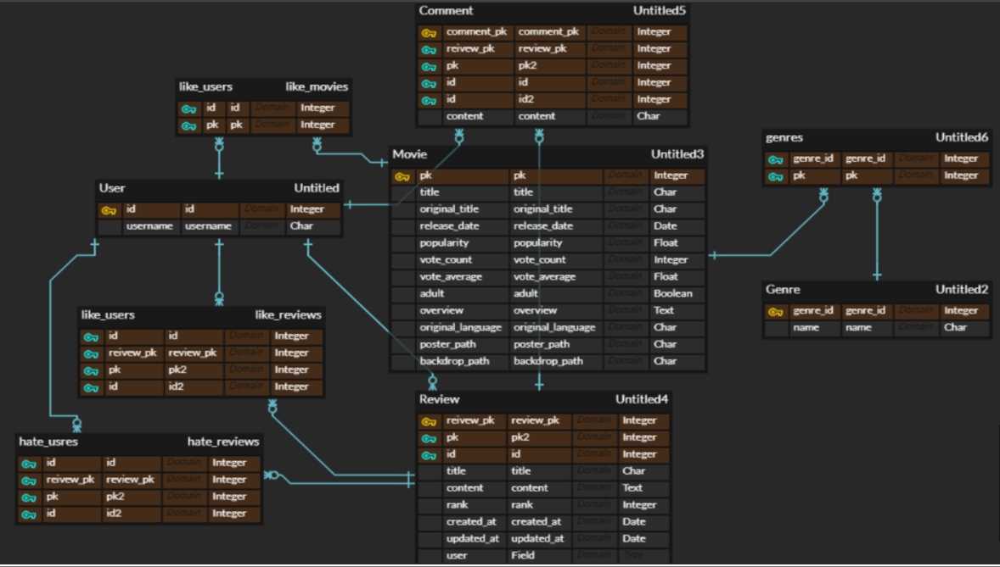
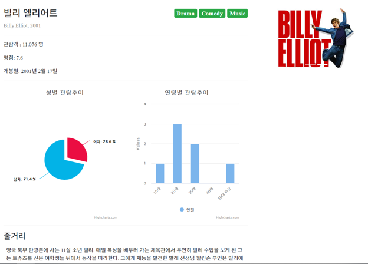

# Readme

Kim-and-Jo  퍼블릭 Ip :13.230.159.83


### 1. 파일구조

```
-LAST_PJT
	-account
		-migrations
		-templates
			-login.html
			-signup.html
		-__init__.py
		-admin.py
		-apps.py
		-forms.py
		-models.py
		-tests.py
		-urls.py
		-views.py
	-Kim_and_Jo
		-settings
			-__init__.py
			-base.pt
			-local.py
			-production.py
		-__init__.py
		-urls.py
		-wsgi.py
	-movies
		-migrations
		-templates
			-detail.html
			-forms.html
			-index.html
			-recommend.html
			-recommend2.html
			-review_detail.html
			-review_forms.html
		-__init__.py
		-admin.py
		-apps.py
		-forms.py
		-models.py
		-tests.py
		-urls.py
		-views.py
	-templates
		-base.html
	-.gitignore
	-db.sqlite3
	-manage.py
	-requirements.txt
```


### 모델링구조




### 영화 데이터 베이스

- ###### 약 500개정도의 영화정보 json file로 이용


### 커뮤니티 기능

- ###### Accounts (계정)

  - ###### admin만 영화 수정/삭제/생성 가능

  

- ###### Movies(영화)

  - ###### 성별/연령대 별 관람추이 표시

  - ###### 리뷰 작성/수정/삭제

  - ###### 리뷰 게시판

  - ###### 영화 평점 등록

  - ###### 리뷰 댓글 달기 기능

  - ###### 리뷰 좋아요 싫어요 기능

  


### 영화 추천 알고리즘

- #### 유저의 리뷰가 없을 경우

  - ###### 유저의 가입 나이를 고려햐여 해당 장르를 추천

- #### 유저의 리뷰가 있을 경우 

  - ###### 유저가 남긴 리뷰평점의 평균을 구해서 영화 평점이 리뷰평균의 +-1 범위내 영화들만 추천해준다

###### 

### 사이트

#### 메인페이지


#### 후기페이지




#### 추천페이지


